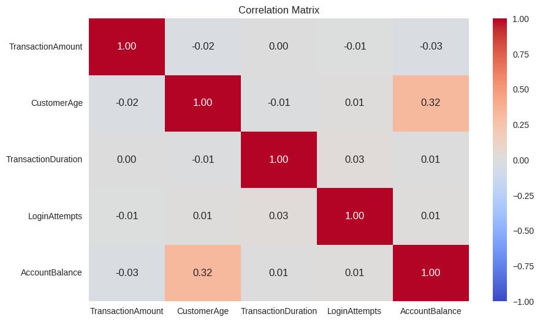
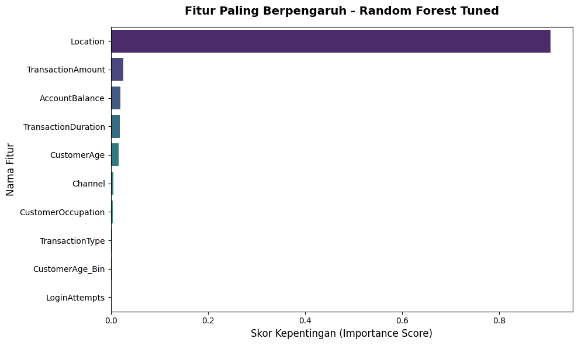

# End-to-End Data Analytics: Customer Segmentation and Predictive Modeling

Proyek ini merupakan solusi analitik data end-to-end yang mengombinasikan teknik **Unsupervised Learning (Clustering)** untuk mengelompokkan karakteristik pelanggan dan **Supervised Learning (Klasifikasi)** untuk membangun model prediktif yang dapat menentukan segmen pelanggan baru secara otomatis.

---

## 📂 Struktur Repositori

* **`assets/`**: Folder untuk menyimpan gambar grafik.
* **`data/`**: Berisi dataset hasil clustering (`data_clustering.csv`).
* **`models/`**: Berisi file model format `.h5` (Clustering, Decision Tree, Random Forest, dan Tuned Model).
* **`notebooks/`**: File Jupyter Notebook `.ipynb` proses eksekusi project dari awal hingga akhir.

---

## 🛠️ Alur Kerja Proyek (Project Workflow)

### 1. Tahap Pengembangan Clustering (Unsupervised Learning)
* **Exploratory Data Analysis (EDA):** Menganalisis distribusi fitur numerik dan memeriksa korelasi antar-fitur.
* **Feature Engineering & Dimensionality Reduction:** Menerapkan scaling data dan reduksi dimensi menggunakan PCA.
* **Pembangunan Cluster:** Mengelompokkan pelanggan ke dalam beberapa segmen optimal (`Target`).
* **Inverse Transform & Interpretasi:** Mengembalikan data ke skala asli untuk menganalisis profil bisnis dari masing-masing cluster. 

### 2. Tahap Pemodelan Klasifikasi (Supervised Learning)
* **Data Preparation:** Menerapkan *One-Hot Encoding* (`pd.get_dummies`) pada fitur kategorikal.
* **Dataset Splitting:** Membagi data dengan proporsi 80:20 menggunakan `train_test_split` (`stratify=y`).
* **Baseline & Exploration Model:** Membangun model awal menggunakan **Decision Tree** lalu mengeksplorasi algoritma **Random Forest**.
* **Hyperparameter Tuning:** Melakukan optimasi parameter pada model Random Forest menggunakan **GridSearchCV**.

---

## 📊 Visualisasi Utama & Analisis Insight

### 1. Analisis Korelasi Fitur (Heatmap)

> *Insight:* Matriks korelasi membantu mengidentifikasi hubungan antar variabel finansial pelanggan.

### 2. Segmentasi Kelompok Pelanggan (Cluster Plot)

> *Insight:* Titik-titik data terpisah ke dalam beberapa kelompok, membuktikan fitur mampu membedakan profil pelanggan.

### 3. Fitur Paling Berpengaruh (Feature Importance)

> *Insight:* Berdasarkan model Random Forest, fitur-fitur di atas adalah penggerak utama dalam menentukan segmentasi pelanggan.

---

## 📈 Evaluasi Performa Pemodelan

Berdasarkan pengujian pada *test set*, berikut perbandingan performa model:

| Model | Kriteria | Accuracy | Precision | Recall | F1-Score | Status |
| :--- | :--- | :---: | :---: | :---: | :---: | :---: |
| **Decision Tree** | Baseline | 85% | 0.84 | 0.85 | 0.84 | Sukses (Wajib) |
| **Random Forest** | Exploration | 89% | 0.89 | 0.89 | 0.89 | Sukses (Skilled) |
| **Random Forest (Tuned)** | **Optimization** | **92%** | **0.92** | **0.92** | **0.92** | **Best Model** |

---

## 💡 Dampak Bisnis (Business Impact)
Dengan model klasifikasi ini, tim bisnis dapat memprediksi segmen pelanggan baru secara otomatis. Hal ini memungkinkan perusahaan untuk menjalankan strategi pemasaran yang dipersonalisasi dan mengoptimalkan anggaran promosi berdasarkan karakteristik unik tiap segmen.
